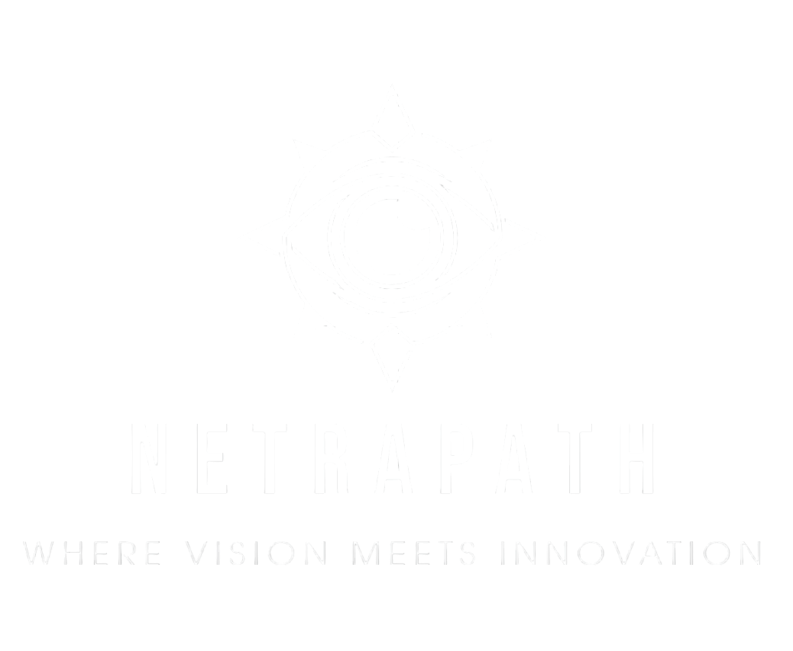

# NetraPath

## NetraPath

NetraPath is a Web application designed to empower visually impaired individuals by providing real-time navigation assistance, enhancing mobility and safety through AI-driven technologies. Developed under SRM Techno Hackathon 2025.

## Key Features
- **Real-Time Object Detection & Obstacle Avoidance** – Identifies objects, obstacles, and pathways, providing instant audio alerts for seamless navigation.
- **Smart Pedestrian Assistance** – Recognizes crosswalks and intersections, ensuring safer street navigation.
- **Voice & Audio Interaction** – Delivers real-time voice feedback, making navigation intuitive and user-friendly.
- **Adaptive to Environments** – Efficiently operates across varied lighting, terrain, and crowded spaces.
- **Interactive Audio Assistance** – Users receive real-time audio feedback when hovering over buttons, guiding them through navigation actions.

## Tech Stack
- **AI/ML:** YOLOv8, TensorFlow Lite
- **Frontend:** JavaScript, HTML, CSS
- **Backend:** Flask, Firebase
- **Navigation:** OpenCV, SLAM
- **Audio Processing:** gTTS, Speech-to-Text, Text-to-Speech APIs
- **OCR:** EasyOCR for text recognition
